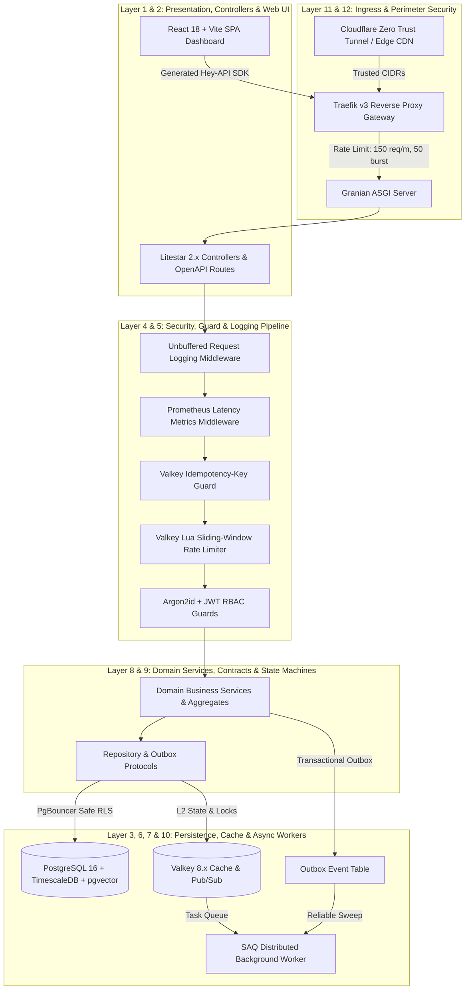
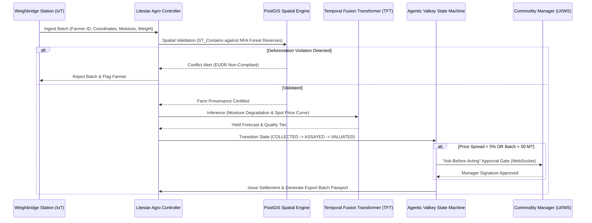
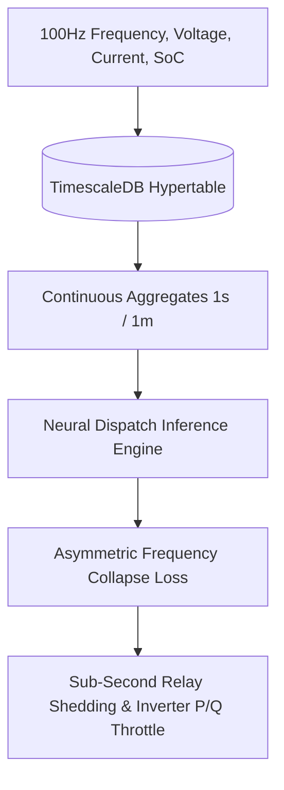

# Domain Blueprint — Canonical Enterprise Platform Specification

> **Authoritative Technical Standard:** This document defines the canonical 12-layer architecture, asynchronous execution pipelines, database schema design, and operational workflows for the Granite platform. It serves as the single source of truth for core platform maintenance, full-stack migrations, and high-complexity national infrastructure domain extensions.

---

## Table of Contents

1. [12-Layer Enterprise Architecture Reference](#1-12-layer-enterprise-architecture-reference)
2. [Canonical Domain Layout & Separation of Concerns](#2-canonical-domain-layout--separation-of-concerns)
3. [Dual-Tier Rate Limiting & Real-IP Ingress Security](#3-dual-tier-rate-limiting--real-ip-ingress-security)
4. [Granian ASGI Runtime & Unbuffered Observability](#4-granian-asgi-runtime--unbuffered-observability)
5. [Selectable OpenAPI 3.1 Interactive Documentation](#5-selectable-openapi-31-interactive-documentation)
6. [TimescaleDB Hypertables, PostgreSQL RLS & PgBouncer Hardening](#6-timescaledb-hypertables-postgresql-rls--pgbouncer-hardening)
7. [Asynchronous Task Distribution & Transactional Outbox](#7-asynchronous-task-distribution--transactional-outbox)
8. [React 18 + Vite Full-Stack Frontend & @hey-api Contract](#8-react-18--vite-full-stack-frontend--hey-api-contract)
9. [National Infrastructure Macro Domain Blueprints](#9-national-infrastructure-macro-domain-blueprints)
   - [9.1 Domain 1: Agentic Agro-Industrial Supply Chain Orchestrator](#91-domain-1-agentic-agro-industrial-supply-chain-orchestrator)
   - [9.2 Domain 2: Unstructured Financial Data Ingestion & Compliance Engine](#92-domain-2-unstructured-financial-data-ingestion--compliance-engine)
   - [9.3 Domain 3: Decentralized Energy Grid Telemetry Predictor & Throttle](#93-domain-3-decentralized-energy-grid-telemetry-predictor--throttle)
10. [Containerized Operational CLI Matrix](#10-containerized-operational-cli-matrix)
11. [Architectural Invariants & Quality Gates](#11-architectural-invariants--quality-gates)

---

## 1. 12-Layer Enterprise Architecture Reference

The platform enforces strict clean architecture principles across 12 distinct functional layers:



| Layer | Responsibility | Technology Stack & Implementation |
| :--- | :--- | :--- |
| **Layer 1: Frontend SPA** | Modern high-performance dashboard UI with 1:1 FastAPI parity | React 18, Vite 6, Tailwind CSS, Lucide Icons, Theme Tokens |
| **Layer 2: API Gateway** | HTTP routing, typed dependency injection, OpenAPI contracts | Litestar 2.10+, Granian ASGI (4 workers), `msgspec` DTOs |
| **Layer 3: Caching & State** | In-memory session state, sliding window counters, idempotency | Valkey 8.x (Redis-compatible), Lua atomic scripts |
| **Layer 4: Access Control** | Authentication, cryptographic signing, role-based guard gates | Pwdlib (Argon2id), PyJWT (HS256/RS256), Litestar Guards |
| **Layer 5: Edge Throttling** | High-level DDoS protection, client IP resolution, SSL termination | Traefik v3, `global-ratelimit`, Cloudflare CIDR Trust |
| **Layer 6: Relational Data** | Multi-tenant persistence, ACID transactions, transactional outbox | PostgreSQL 16, SQLAlchemy 2.0 Async, Advanced Alchemy |
| **Layer 7: Time-Series CDC** | High-frequency telemetry ingestion, compression, audit logging | TimescaleDB Hypertables, Chunk Compression Policies |
| **Layer 8: Vector Search** | Semantic embeddings, taxonomy lookup, cosine similarity matching | `pgvector` 0.7+, HNSW index, OpenAI text-embedding-3 |
| **Layer 9: Business Core** | Clean architecture entities, aggregates, domain protocols | Pure Python 3.11+, Zero external framework imports |
| **Layer 10: Task Queue** | Distributed job queues, recurring cron schedules, DLQ replays | SAQ (Simple Async Queue) on Valkey, Celery-free architecture |
| **Layer 11: Edge Tunnel** | Zero-port-forwarding public ingress, private VPC interconnection | Cloudflare Zero Trust Tunnel (`cloudflared_tunnel`) |
| **Layer 12: Observability** | Real-time structured access logs, Prometheus metrics, Sentry tracing | Structlog, Prometheus Client `/metrics`, Unbuffered stdout |

---

## 2. Canonical Domain Layout & Separation of Concerns

Every business domain in `backend/src/app/domain/` is organized with strict isolation:

```text
backend/src/app/
├── domain/
│   └── <feature>/
│       ├── __init__.py         # Public exports (models, schemas, interfaces, services)
│       ├── models.py           # Pure SQLAlchemy 2.0 ORM entities (maps to DB table)
│       ├── schemas.py          # msgspec.Struct DTOs (Create, Update, Read, FilterParams)
│       ├── interfaces.py       # typing.Protocol ABCs for repository and service ports
│       └── services.py         # Pure business logic, state machines, and calculations
│
├── adapters/
│   └── postgres/
│       ├── <feature>_repository.py   # Concrete AsyncRepository satisfying interface
│       └── __init__.py               # Re-exports models so Alembic autogenerates migrations
│
└── presentation/
    └── api/
        └── v1/
            └── <feature>_controller.py  # Litestar Class-Based Controller with DI & Guards
```

### Dependency Inversion Rules
1. **Inward Dependencies Only:** `domain/` must never import from `adapters/` or `presentation/`.
2. **DTO Serialization:** All API boundary data structures must inherit from `msgspec.Struct` with `frozen=True`.
3. **Async Database Sessions:** All queries must use `sqlalchemy.ext.asyncio.AsyncSession`.

---

## 3. Dual-Tier Rate Limiting & Real-IP Ingress Security

The platform employs a defense-in-depth throttling model combining edge network protection with fine-grained application quota enforcement:

```
[Inbound Client Request]
          │
          ▼
┌────────────────────────────────────────────────────────┐
│  Tier 1: Traefik v3 Edge Ingress Proxy                 │
│  - Middleware: global-ratelimit                        │
│  - Limit: 150 req/min, Burst: 50                       │
│  - Source: ipStrategy (depth 1)                        │
└────────────────────────────────────────────────────────┘
          │
          ▼
┌────────────────────────────────────────────────────────┐
│  Real IP Resolution Middleware (Litestar)              │
│  1. CF-Connecting-IP (Cloudflare Edge CDN)             │
│  2. X-Forwarded-For (First proxy IP in CSV)            │
│  3. ASGI Scope Client Tuple [0]                        │
└────────────────────────────────────────────────────────┘
          │
          ▼
┌────────────────────────────────────────────────────────┐
│  Tier 2: Valkey Lua Sliding-Window Counter             │
│  - Category "auth" (/api/v1/auth/*)     -> 5 req/min   │
│  - Category "webhook" (/api/v1/hook/*)  -> 500 req/min │
│  - Category "api" (General Endpoints)   -> 120 req/min │
│  - Emits RFC RateLimit-* and Retry-After Headers       │
└────────────────────────────────────────────────────────┘
```

### Atomic Lua Sliding-Window Script

The sliding window algorithm prevents edge-of-window bursting by calculating weighted traffic across the boundary of the previous and current 60-second intervals:

$$\text{Estimated Count} = \lfloor \text{Previous Count} \cdot (1 - \text{Weight}) + \text{Current Count} \rfloor$$

```lua
local current_key = KEYS[1]
local prev_key = KEYS[2]
local limit = tonumber(ARGV[1])
local current_weight = tonumber(ARGV[2])

local current_count = tonumber(redis.call('get', current_key) or '0')
local prev_count = tonumber(redis.call('get', prev_key) or '0')

local estimated_count = math.floor(prev_count * (1 - current_weight) + current_count)

if estimated_count >= limit then
    return {0, limit - estimated_count, estimated_count}
else
    redis.call('incr', current_key)
    redis.call('expire', current_key, 120)
    return {1, limit - (estimated_count + 1), estimated_count + 1}
end
```

### Cloudflare Proxy Trust & Edge Profile
- **Development Ingress:** Runs Traefik without Cloudflare tunnel requirement for instant zero-configuration boot.
- **Production Edge Profile:** Activating `--profile production` starts `cloudflared_tunnel` (`docker.io/cloudflare/cloudflared:latest`) routing traffic to Traefik while trusting Cloudflare proxy IP ranges (`173.245.48.0/20`, `103.21.244.0/22`, `141.101.64.0/18`, etc.).

---

## 4. Granian ASGI Runtime & Unbuffered Observability

The application executes on **Granian** (Rust-based HTTP/ASGI server) using 4 worker processes and 2 runtime threads per core:

```bash
granian --interface asgi app.main:app \
  --host 0.0.0.0 --port 8000 \
  --workers 4 --runtime-threads 2 \
  --access-log --log-level info
```

### Instant Stdout Streaming
To ensure live log parity with docker compose / podman logs during rapid user interactions, the `RequestLoggingMiddleware` immediately flushes every request:

```python
sys.stdout.write(
    f'[INFO] {client_ip} - "{method} {path} HTTP/{scope.get("http_version", "1.1")}" {status_code} ({duration_ms}ms)\n'
)
sys.stdout.flush()
```

---

## 5. Selectable OpenAPI 3.1 Interactive Documentation

Litestar's OpenAPI engine dynamically mounts interactive API documentation engines based on `settings.DOCS_UI` (configured in `.env` and selectable during project scaffolding via `copier.yml`):

| UI Engine | Route Path | Characteristics | Default Status |
| :--- | :--- | :--- | :--- |
| **Swagger UI** | `/docs` / `/docs/swagger` | Classic, widely recognized interface with OAuth2 Password flow | **Default** |
| **Scalar** | `/docs/scalar` | Modern, clean interactive client with embedded code snippets | Alternative |
| **Redoc** | `/docs/redoc` | 3-column reference layout optimized for complex schema browsing | Alternative |
| **Elements (Stoplight)** | `/docs/elements` | Navigation tree layout supporting deeply nested endpoints | Alternative |
| **RapiDoc** | `/docs/rapidoc` | Web-component based lightweight interactive API console | Alternative |

---

## 6. TimescaleDB Hypertables, PostgreSQL RLS & PgBouncer Hardening

### Hypertables with Unbounded TEXT Columns
For optimal continuous rollups and 90% chunk compression without `WARNING: column type "character varying" used in hypertable` diagnostics, all string attributes in TimescaleDB hypertables are modeled as `sa.Text`:

```python
class AuditLog(Base):
    __tablename__ = "audit_logs"

    # Compound Primary Key mandatory for TimescaleDB partitioning
    id: Mapped[uuid.UUID] = mapped_column(UUID(as_uuid=True), primary_key=True, default=uuid.uuid4)
    created_at: Mapped[datetime] = mapped_column(
        DateTime(timezone=True), server_default=text("now()"), primary_key=True
    )
    user_id: Mapped[uuid.UUID | None] = mapped_column(UUID(as_uuid=True), nullable=True)
    tenant_id: Mapped[uuid.UUID | None] = mapped_column(UUID(as_uuid=True), nullable=True)
    action: Mapped[str] = mapped_column(Text, nullable=False)
    resource_type: Mapped[str] = mapped_column(Text, nullable=False)
    diff: Mapped[dict | None] = mapped_column(JSONB, nullable=True)
```

### PgBouncer Transaction Pooling & RLS Safety
To support connection scale without state leakage across transactions, multi-tenant isolation is applied strictly via PostgreSQL transaction-local configuration:

```sql
SELECT set_config('app.current_user_id', :user_id, true),
       set_config('app.current_tenant_id', :tenant_id, true),
       set_config('app.current_role', :role, true);
```

Because `is_local=true` is asserted on every transaction begin, context is automatically cleared upon `COMMIT` or `ROLLBACK`.

---

## 7. Asynchronous Task Distribution & Transactional Outbox

| Criticality Tier | Mechanism | Target Use Case |
| :--- | :--- | :--- |
| **Tier 1: Ephemeral** | Litestar `BackgroundTask` | Welcome emails, non-critical webhooks, lightweight notifications |
| **Tier 2: Retriable** | SAQ Distributed Worker | Batch data exports, document OCR pipelines, daily telemetry summaries |
| **Tier 3: Guaranteed** | Transactional Outbox + DLQ | Financial transactions, tax submissions, order placement events |

---

## 8. React 18 + Vite Full-Stack Frontend & @hey-api Contract

The frontend workspace ([frontend/](file:///home/pat/Business/LiteStar/frontend/)) provides a complete, modern React 18 application matching 1:1 FastAPI design tokens:

- **Styling & Theming:** Tailwind CSS v3 with CSS variables (`--primary: 174 85% 35%` Teal `#009688`), full dark/light appearance switching, and modular UI primitives (`Button`, `Input`, `Card`, `Badge`, `Modal`).
- **Contract SDK Synchronization:** Type-safe API client generated into `frontend/src/client/` via `@hey-api/openapi-ts` from exported OpenAPI 3.1 definitions.
- **Root Relative URL Normalization:** Automatically strips duplicate `/api/v1` base URLs to route cleanly through local Vite development proxies.

---

## 9. National Infrastructure Macro Domain Blueprints

### 9.1 Domain 1: Agentic Agro-Industrial Supply Chain Orchestrator

#### Strategic Context
Designed to power national agro-industrialization targets (UGX 2.26T allocation) and Uganda's USD 2.46B coffee export milestone while enforcing mandatory **EU Deforestation Regulation (EUDR)** geolocation compliance.

#### Architecture Pipeline


#### Key Implementation Components
1. **Spatial Boundary Validation:** PostGIS SQL functions verifying polygon coordinates against protected forest reserves:
   ```sql
   SELECT ST_Intersects(f.farm_polygon, nfa.geom) AS has_deforestation_violation
   FROM coffee_farms f, nfa_protected_forests nfa
   WHERE f.id = :farm_id;
   ```
2. **Multi-Agent State Pipeline:** Valkey Pub/Sub coordinating discrete transitions: `COLLECTED` $\rightarrow$ `ASSAYED` $\rightarrow$ `VALUATED` $\rightarrow$ `COMMITTED` $\rightarrow$ `DISPATCHED`.

---

### 9.2 Domain 2: Unstructured Financial Data Ingestion & Compliance Engine

#### Strategic Context
Implements Uganda Revenue Authority (URA) Digital Revenue Mobilization Strategy, facilitating automated **EFRIS** e-invoicing compliance, real-time fiscalized QR generation, and anti-fraud VAT validation.

#### Architecture Pipeline
```mermaid
flowchart LR
    INPUT[WhatsApp Receipt / CSV / PDF] --> OCR[LayoutLMv3 2D Spatial Extraction]
    OCR --> NORM[Standardized Invoice Payload]
    NORM --> VEC[pgvector Cosine Lookup (15,000+ URA UNSPSC Codes)]
    VEC --> TAX[Tax Calculation Engine (18% VAT / 6% WHT)]
    TAX --> OUTBOX[Transactional Outbox Insert]
    OUTBOX --> SAQ[SAQ Worker mTLS Signer]
    SAQ --> URA[URA EFRIS Gateway API]
    URA --> QR[Dynamic Fiscal QR Code Generation]
```

#### Key Implementation Components
1. **Semantic Commodity Taxonomy Matching:** High-dimensional vector cosine matching ($\text{Cosine Distance} \le 0.15$) against 15,000+ URA commodity classifications:
   ```python
   stmt = (
       select(UNSPSCClassification)
       .order_by(UNSPSCClassification.embedding.cosine_distance(item_vector))
       .limit(1)
   )
   ```
2. **mTLS Fiscal Outbox Relay:** Ensures zero invoice loss by persisting fiscal events within the local database transaction before dispatching via asynchronous mTLS to URA.

---

### 9.3 Domain 3: Decentralized Energy Grid Telemetry Predictor & Throttle

#### Strategic Context
Optimizes Uganda's UGX 2.07T power generation mix across rural off-grid solar-hydro microgrids, industrial battery energy storage systems (BESS), and national grid tie-points.

#### Architecture Pipeline


#### Asymmetric Grid Collapse Loss Formulation
The real-time neural dispatch optimizer penalizes grid frequency degradation below statutory limits ($49.5\text{ Hz}$) and battery State-of-Charge (SoC) exhaustion exponentially:

$$\mathcal{L} = \text{MSE}(\text{Load}) + \alpha \cdot \max(0, 49.5 - \hat{f})^2 + \beta \cdot \max(0, 20\% - \hat{\text{SoC}})^2$$

Where:
- $\hat{f}$ represents projected grid frequency over the next 10-second dispatch horizon.
- $\hat{\text{SoC}}$ represents battery storage reserve percentage.
- $\alpha, \beta$ are non-linear penalty weights triggering instant breaker actuation.

---

## 10. Containerized Operational CLI Matrix

All lifecycle, maintenance, linting, testing, and generation tasks execute inside isolated containers:

| Command | Action | Runtime Environment |
| :--- | :--- | :--- |
| **`make up`** | Boot core development mesh (DB, Valkey, Backend, Frontend, Traefik) | Rootless Podman Compose |
| **`make down`** | Cleanly stop containers while preserving database storage volumes | Podman Engine |
| **`make prod-up`** | Boot full production stack including Cloudflare Zero Trust tunnel | Compose `--profile production` |
| **`make prod-logs`** | Stream production logs across all containers including tunnel | Compose `--profile production` |
| **`make frontend-sync`** | Export OpenAPI 3.1 schema and compile Hey-API TypeScript SDK | Containerized Backend + Frontend |
| **`make frontend-build`** | Execute TypeScript compilation and Vite static bundle production | `node:22-alpine` Container |
| **`make lint`** | Run Ruff linter and code formatting validation rules | `backend` Container |
| **`make test`** | Run complete Pytest test suite (77+ tests) with rollback savepoints | `backend` Container |
| **`make logs`** | Stream live unbuffered stdout logs from all services concurrently | Podman Log Multiplexer |
| **`make logs-api`** | Stream live request access logs from Litestar / Granian backend | Backend Container Stream |

---

## 11. Architectural Invariants & Quality Gates

The following invariants are strictly enforced in CI/CD quality gates:

1. **Inward Domain Independence:** The `domain/` package must never import from `adapters/` or `presentation/`.
2. **Zero Schema Drift:** `make frontend-sync` must be executed and the generated `frontend/src/client/` committed with any endpoint change.
3. **Hypertable Type Safety:** All string columns in TimescaleDB hypertables must use unbounded `Text` (never `VARCHAR`).
4. **PgBouncer RLS Isolation:** All multi-tenant session parameters must be set via `set_config(..., is_local=true)` on transaction begin.
5. **Fail-Open Gateway Resilience:** Cache-backed rate limiters and idempotency filters must degrade gracefully if the cache cluster temporarily becomes unreachable.

---

*Authored by Principal Enterprise Systems Architecture Team — Version 2.4.0 (2026)*
