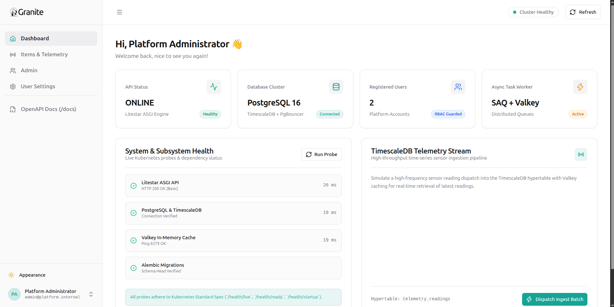
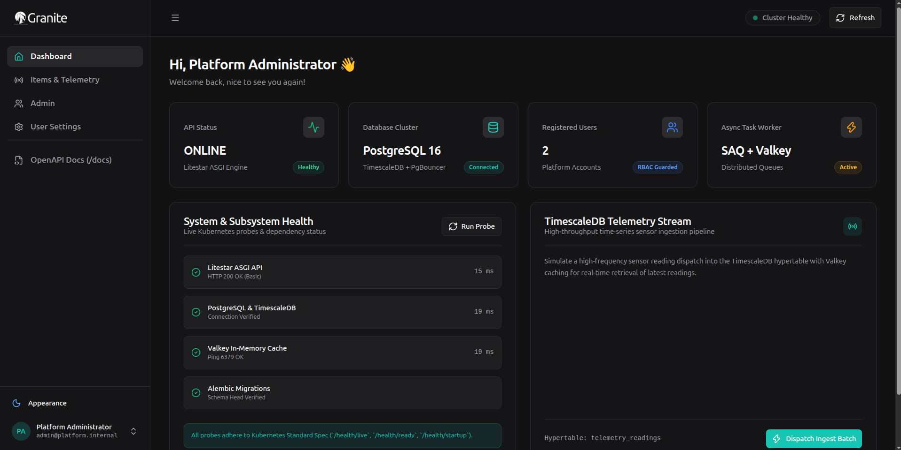
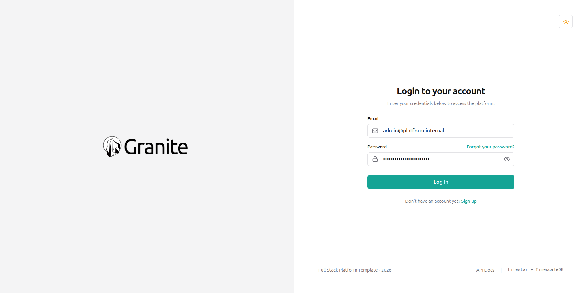
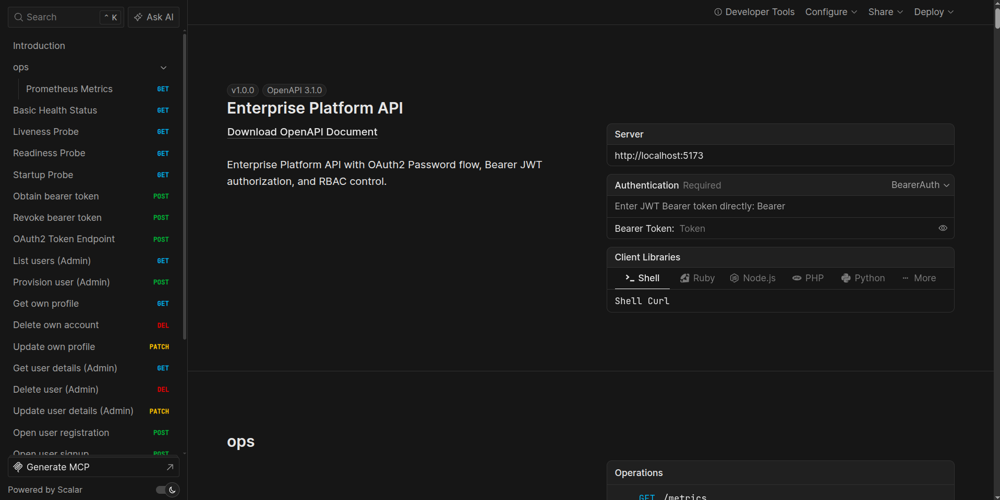
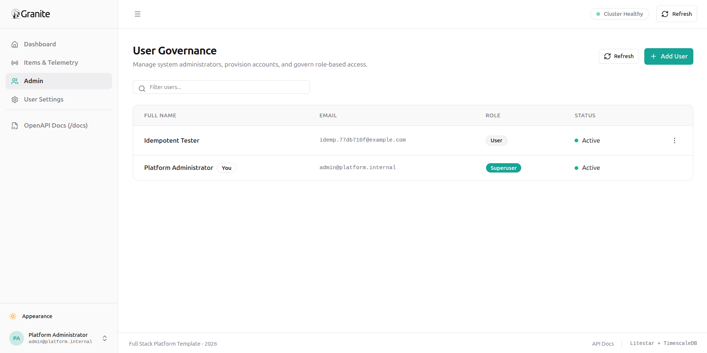
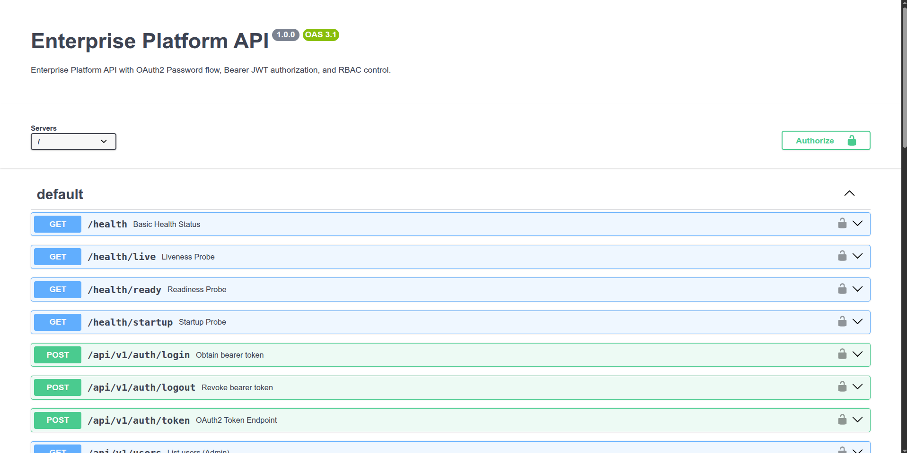

# Granite Template

<p align="center">
  <em>Enterprise-grade, asynchronous full-stack application template powered by Litestar 2.x, React 18, PostgreSQL 16, TimescaleDB, Valkey, and Traefik v3.</em>
</p>

<p align="center">
  <a href="https://github.com/le-patrice/granite-template/actions" target="_blank">
    
  </a>
  <a href="https://litestar.dev" target="_blank">
    
  </a>
  <a href="https://react.dev" target="_blank">
    
  </a>
  <a href="https://www.postgresql.org" target="_blank">
    
  </a>
  <a href="https://valkey.io" target="_blank">
    
  </a>
  <a href="https://traefik.io" target="_blank">
    
  </a>
</p>

---

<!-- Primary Dashboard Preview Slot -->
<p align="center">
  
  
</p>

---

## Features

* **High-Throughput ASGI Backend:** Built on [Litestar 2.x](https://litestar.dev) and powered by [Granian](https://github.com/emmett-framework/granian) (4 asynchronous worker processes) with unbuffered stdout logging.
* **Modern Single-Page Application (SPA):** React 18 + Vite + TypeScript with Tailwind CSS design token parity, light/dark/system theme engine, and inline form error validation.
* **Turnkey Typed Client Generation:** Automated `@hey-api/openapi-ts` SDK pipeline exporting backend schemas to type-safe TypeScript fetch clients.
* **Dual-Tier Ingress & Rate Limiting:** Traefik v3 burst rate limiter coupled with an atomic Valkey Lua sliding-window limiter (Auth: `5 req/min`, Webhooks: `500 req/min`, API: `120 req/min`).
* **Multi-Engine Interactive OpenAPI Docs:** Scalar interface mounted on `/docs`, Swagger UI on `/docs/swagger`, and Redoc on `/docs/redoc`.
* **Hybrid Relational & Time-Series Engine:** PostgreSQL 16 managed via SQLAlchemy 2.0 async sessions and Alembic, enhanced with TimescaleDB hypertables for compressed audit logging.
* **PgBouncer Connection Multiplexing:** Transaction pooling isolating database backends from connection exhaustion under high concurrency.
* **Asynchronous Task Workers:** Background task dispatch and retry schedules executed via [SAQ](https://github.com/tobymao/saq) backed by Valkey.
* **Zero-Exposed-Port Production Ingress:** Built-in Cloudflare Tunnel integration (`cloudflared` profile) with trusted proxy header extraction (`CF-Connecting-IP`).
* **Rootless Container Runtime:** Fully managed multi-service environment orchestrated with Podman/Docker Compose.

---

## Visual Tour

<p align="center">
  
  
</p>

<p align="center">
  
  
</p>

---

## Getting Started

### 1. Generate Your Project with Copier

Generate a new, tailored application repository using [Copier](https://copier.readthedocs.io/):

```bash
# Install Copier if not already available
pipx install copier

# Scaffold your new project from this template repository
copier copy git@github.com:le-patrice/granite-template my-project --trust

# Enter your newly created project directory
cd my-project
```

### 2. Configure Environment Variables

```bash
# Initialize local environment file from example template
cp .env.example .env
```

Review `.env` to customize your project name, initial superuser credentials, database passwords, and domain hostnames.

### 3. Build & Launch Container Stack

```bash
# Build local container images
make build

# Launch services in the background
make up

# Apply initial database migrations and seed default superuser
make migrate
```

---

## Local Access & Development Services

Once running, access the local service interfaces:

| Service / Interface | Local Address | Authentication / Default Credentials |
| --- | --- | --- |
| **Frontend Web App** | [http://localhost:5173](http://localhost:5173) | `FIRST_SUPERUSER_EMAIL` / `FIRST_SUPERUSER_PASSWORD` |
| **Backend REST API** | [http://localhost:8000/api/v1](http://localhost:8000/api/v1) | JWT Bearer Token |
| **Scalar API Documentation** | [http://localhost:8000/docs](http://localhost:8000/docs) | Public |
| **Swagger UI Documentation** | [http://localhost:8000/docs/swagger](http://localhost:8000/docs/swagger) | Public |
| **Redoc API Documentation** | [http://localhost:8000/docs/redoc](http://localhost:8000/docs/redoc) | Public |
| **Mailpit Test Inbox** | [http://localhost:8025](http://localhost:8025) | No Auth (SMTP on `:1025`) |
| **Traefik Dashboard** | [http://localhost:8080](http://localhost:8080) | Local Dev Only |

---

## Developer Operations (Makefile Reference)

| Command | Action / Target Scope |
| --- | --- |
| `make up` | Start all core local services (API, DB, Valkey, PgBouncer, Worker, Frontend, Traefik). |
| `make down` | Stop all running containers without destroying persistent volumes. |
| `make build` | Rebuild local container images with cached dependencies. |
| `make logs` | Stream consolidated stdout logs across all running containers. |
| `make logs-api` | Stream unbuffered stdout logs exclusively from the Litestar backend. |
| `make migrate` | Execute pending Alembic database migrations and run initial superuser seeding. |
| `make frontend-sync` | Export latest OpenAPI schema and regenerate `@hey-api` TypeScript client contracts. |
| `make frontend-build` | Run TypeScript type checks and produce production static assets. |
| `make lint` | Run Ruff formatters and linters across backend code. |
| `make test` | Execute complete backend Pytest suite inside the container environment. |
| `make prod-up` | Start production stack with active Cloudflare Tunnel (`--profile production`). |

---

## Production Deployment (Edge Tunnel)

To deploy to a remote cloud VPS with zero open inbound firewall ports:

1. Obtain a Cloudflare Tunnel Token from your Cloudflare Zero Trust Dashboard.
2. In your remote `.env`, set:
```bash
CLOUDFLARED_TUNNEL_TOKEN=eyJhIjoi...
```

3. Run the production profile:
```bash
make prod-up
```

Traefik routes traffic through the internal container mesh, trusting Cloudflare CIDRs and extracting real client IPs from `CF-Connecting-IP`.
