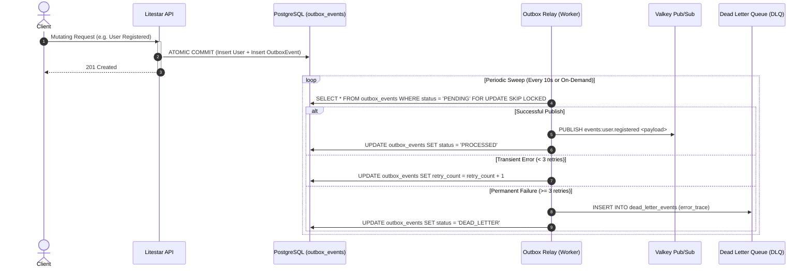

# Architectural Specification (Arc42 & C4 Model)

> **Document Classification:** Technical Architecture & Design Reference  
> **Status:** Current / Production Baseline  
> **Standard:** Arc42 Architectural Framework + C4 Level 2 Model

---

## 1. System Overview & Context

LiteForge is an enterprise platform designed for extreme concurrent throughput, sub-millisecond API response latency, and operational resilience under high load. It combines a Rust-based ASGI runtime (**Granian**) with a lightweight Python web framework (**Litestar**), an asynchronous ORM layer (**SQLAlchemy + Advanced Alchemy**), and an edge routing mesh (**Traefik v3** + **Cloudflare Tunnels**).

---

## 2. C4 Level 2 Container Diagram

The following diagram illustrates the containers, processes, protocols, and data pathways composing the platform runtime:

```mermaid
C4Container
    title Container Diagram for LiteForge Platform

    Person(user, "User / API Consumer", "Web browser, mobile client, or third-party service")
    System_Ext(cloudflare, "Cloudflare Global Edge", "DDoS mitigation, SSL termination, Zero Trust Tunnel")

    Container_Boundary(mesh, "LiteForge Container Mesh (Rootless Podman)")
        Container(tunnel, "Cloudflare Tunnel", "cloudflared:latest", "Outbound encrypted tunnel to Cloudflare Edge")
        Container(traefik, "Traefik Ingress Router", "traefik:v3.3 (Port 80)", "Cleartext HTTP/2 reverse proxy, CORS, rate limits, SSL headers")
        Container(frontend, "Frontend SPA", "Node 22 / Nginx (Port 5173 / 80)", "React 18 + TypeScript + Vite user interface")
        Container(api, "Litestar API Engine", "Python 3.11 + Granian (Rust, Port 8000)", "ASGI Web API, RBAC guards, DI providers, metrics, outbox writes")
        Container(worker, "SAQ Background Worker", "Python 3.11 + SAQ", "Asynchronous distributed task queue consumer & cron scheduler")
        Container(pgbouncer, "PgBouncer Gateway", "pgbouncer:latest (Port 6432)", "Transaction pooling gateway for high-concurrency connections")
        ContainerDb(db, "TimescaleDB + pgvector", "PostgreSQL 16 (Port 5432)", "Hypertables, automated compression, semantic embeddings, outbox table")
        ContainerDb(cache, "Valkey In-Memory Cache", "valkey:8-alpine (Port 6379)", "Session state, token revocation blocklist, Pub/Sub, idempotency cache")
        Container(mailpit, "Mailpit Mock SMTP", "axllent/mailpit (Port 1025 / 8025)", "Local email capture & inspection UI")
    Boundary_End()

    Rel(user, cloudflare, "Sends requests to", "HTTPS :443")
    Rel(cloudflare, tunnel, "Routes traffic via encrypted tunnel", "gRPC / HTTP2")
    Rel(tunnel, traefik, "Proxies to local ingress", "HTTP :80")
    Rel(user, traefik, "Local developer access", "HTTP :8000")
    Rel(traefik, frontend, "Routes /* to", "HTTP :5173")
    Rel(traefik, api, "Routes /api/*, /docs, /health, /metrics to", "HTTP :8000")
    Rel(api, pgbouncer, "Queries & commits via", "PostgreSQL Asyncpg (Port 6432)")
    Rel(api, db, "Direct DDL & migrations via", "PostgreSQL Asyncpg / Psycopg2 (Port 5432)")
    Rel(pgbouncer, db, "Maintains connection pool to", "PostgreSQL TCP :5432")
    Rel(api, cache, "Validates tokens & caches idempotency in", "Valkey RESP3 :6379")
    Rel(api, mailpit, "Dispatches local emails to", "SMTP :1025")
    Rel(worker, cache, "Pulls async jobs & cron triggers from", "Valkey RESP3 :6379")
    Rel(worker, pgbouncer, "Executes batch background tasks via", "PostgreSQL Asyncpg :6432")
```

---

## 3. Clean Architecture Inward Dependency Model

The backend codebase is structured around strict Clean Architecture boundaries where dependencies point strictly inward toward the core domain:

```
┌────────────────────────────────────────────────────────┐
│  Presentation Layer (Litestar Controllers, Routes)     │
│  └─► Adapters Layer (Postgres Repositories, Outbox)    │
│      └─► Core Layer (Settings, Logging, Security)      │
│          └─► Domain Layer (Models, Schemas, Contracts) │
└────────────────────────────────────────────────────────┘
```

### Layer Responsibilities

| Layer | Path | Allowed Dependencies | Responsibilities |
| :--- | :--- | :--- | :--- |
| **Domain** | [`src/app/domain/`](file:///home/pat/Business/LiteStar/backend/src/app/domain/) | Python standard library, `msgspec`, `SQLAlchemy` declarative models | Enterprise entities, msgspec DTOs, and repository interfaces (`contracts.py`). Framework-free. |
| **Core** | [`src/app/core/`](file:///home/pat/Business/LiteStar/backend/src/app/core/) | Standard library, `pydantic-settings`, `structlog`, `pwdlib`, `pyjwt` | Cross-cutting concerns: Settings, structured logging, JWT signing, password hashing, worker queue, idempotency, circuit breakers. |
| **Adapters** | [`src/app/adapters/`](file:///home/pat/Business/LiteStar/backend/src/app/adapters/) | `advanced-alchemy`, `sqlalchemy`, `redis/valkey`, `pgvector` | Concrete implementations of domain repository contracts (`PostgresUserRepository`, `PostgresTelemetryRepository`, `PostgresOutboxRepository`). |
| **Presentation** | [`src/app/presentation/`](file:///home/pat/Business/LiteStar/backend/src/app/presentation/) | `litestar`, Domain layer, Adapters layer | HTTP Controllers (`AuthController`, `UsersController`, `TelemetryController`, `HealthController`), route guards, and dependency injection providers. |

---

## 4. Database Topology & Storage Design

### 4.1 PostgreSQL 16 + TimescaleDB + pgvector
The persistence layer integrates relational integrity with specialized engines for time-series telemetry and semantic vector embeddings.

1. **Hypertables (`telemetry_readings`):**
   - Automatically partitioned by `recorded_at` in 7-day chunk intervals.
   - Compound index on `(transformer_id, recorded_at DESC)` for instantaneous time-series range lookups.
2. **Automated Compression Policy:**
   - Chunks older than `7 days` are compressed in columnar storage:
     ```sql
     SELECT add_compression_policy('telemetry_readings', INTERVAL '7 days');
     ```
   - Achieves up to 90% disk reduction while remaining queryable.
3. **Automated Retention Policy:**
   - Chunks older than `90 days` are dropped automatically:
     ```sql
     SELECT add_retention_policy('telemetry_readings', INTERVAL '90 days');
     ```
4. **Hybrid Search (RRF with `pg_trgm` + `pgvector` HNSW):**
   - **Lexical Search:** GIN trigram indexes on `email` and `full_name` using `pg_trgm` similarity.
   - **Vector Search:** HNSW cosine similarity index on embedding vectors using `pgvector`.
   - **Reciprocal Rank Fusion (RRF):** Combined scoring formula implemented in [`search_utils.py`](file:///home/pat/Business/LiteStar/backend/src/app/adapters/postgres/search_utils.py):
     $$RRF(d) = \frac{1}{60 + \text{rank}_{\text{lexical}}(d)} + \frac{1}{60 + \text{rank}_{\text{vector}}(d)}$$

---

## 5. Event & Resilience Topology

### 5.1 Transactional Outbox & Dead Letter Queue (DLQ)
To guarantee distributed transaction consistency without distributed 2PC locking, all domain state changes and outbound events are written to `outbox_events` within the **same atomic database transaction**.



### 5.2 Idempotency Middleware
- Mutating endpoints (`POST`/`PUT`/`PATCH`) intercept `Idempotency-Key` headers.
- **In-flight Locking:** Returns `409 Conflict` if a matching request is currently executing.
- **Response Cache:** Successful responses are cached in Valkey for 24 hours. Subsequent duplicate requests return the cached response with `X-Cache-Idempotent: HIT` and skip database mutations.

### 5.3 Circuit Breaker State Machine
- Protects external integration calls (e.g. SMTP, payment APIs, microservices).
- State transitions:
  - `CLOSED`: Normal operation.
  - `OPEN`: Tripped after consecutive failure thresholds (e.g. 5 failures); calls are immediately rejected with `CircuitOpenException`.
  - `HALF_OPEN`: After recovery cooldown (e.g. 30s), trial requests test upstream health before resetting to `CLOSED`.
