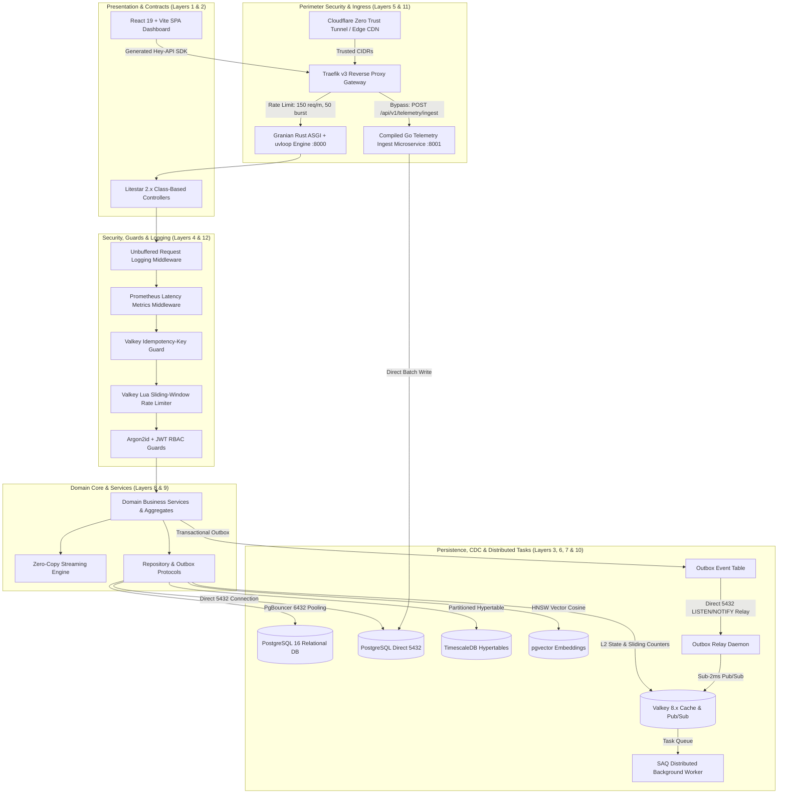

# Domain Blueprint — Canonical Developer Reference & 12-Layer Enterprise Platform Specification

> **Authoritative Standard:** This document is the authoritative standard for scaffolding new business domains in Granite, porting external sub-projects into the platform, configuring ORM models, background tasks, and integrating both React/Vite and Astro TypeScript frontends with end-to-end type safety across the complete 12-layer clean architecture stack.

---

## Table of Contents

1. [Canonical Domain Directory Structure](#1-canonical-domain-directory-structure)
2. [Layer-by-Layer Implementation Blueprint](#2-layer-by-layer-implementation-blueprint)
3. [Asynchronous Execution Matrix](#3-asynchronous-execution-matrix)
4. [Database Migrations & Alembic Workflow](#4-database-migrations--alembic-workflow)
5. [Full-Stack Frontend Integration](#5-full-stack-frontend-integration)
6. [Step-by-Step Migration Recipe: Porting Standalone Sub-Projects](#6-step-by-step-migration-recipe-porting-standalone-sub-projects)
7. [Rules & Architectural Invariants](#7-rules--architectural-invariants)
8. [The 12-Layer Enterprise Architecture Reference](#8-the-12-layer-enterprise-architecture-reference)
9. [Dual-Tier Rate Limiting & Real-IP Security Pipeline](#9-dual-tier-rate-limiting--real-ip-security-pipeline)
10. [Selectable OpenAPI 3.1 Documentation System](#10-selectable-openapi-31-documentation-system)
11. [Production Edge Profile & Cloudflare Tunnel Architecture](#11-production-edge-profile--cloudflare-tunnel-architecture)
12. [Containerized Operational CLI Targets Matrix](#12-containerized-operational-cli-targets-matrix)
13. [Dual-Engine Architecture & Pure Podman Infrastructure Deep Dive](#13-dual-engine-architecture--pure-podman-infrastructure-deep-dive)

---

## 1. Canonical Domain Directory Structure

Every new feature domain follows this layout exactly. Replace `<feature>` with the domain name (e.g., `orders`, `invoicing`, `nlp_pipelines`, `device_telemetry`):

```text
backend/
├── src/app/
│   ├── domain/
│   │   └── <feature>/
│   │       ├── __init__.py         # re-exports: models, schemas, interfaces, services
│   │       ├── models.py           # Pure SQLAlchemy ORM entity (maps to DB table)
│   │       ├── schemas.py          # msgspec.Struct: CreatePayload, UpdatePayload, ReadResponse, FilterParams
│   │       ├── interfaces.py       # Abstract Repository & Service Protocols (typing.Protocol)
│   │       └── services.py         # Pure domain business logic & orchestrators
│   │
│   ├── adapters/
│   │   └── postgres/
│   │       ├── <feature>_repository.py   # Concrete async repository (implements domain protocol)
│   │       └── __init__.py               # imports all models so Alembic auto-detects them
│   │
│   └── presentation/
│       └── api/
│           └── v1/
│               └── <feature>_controller.py  # Litestar Class-Based Controller with DI & Guards
│
├── alembic/
│   └── versions/
│       └── <NNNN>_add_<feature>_tables.py  # Auto-generated Alembic migration
│
└── tests/
    ├── api/
    │   └── test_<feature>.py               # Integration tests (async_client fixture)
    └── domain/
        └── test_<feature>_services.py      # Pure unit tests (no DB)
```

**Rules:**
- The `domain/` layer must **never** import from `adapters/` or `presentation/`. Direction of dependency is always **inward**.
- `adapters/` may import from `domain/` (to implement interfaces) but never from `presentation/`.
- `presentation/` imports from `domain/` (schemas, interfaces) and may use `adapters/` via dependency injection only.

---

## 2. Layer-by-Layer Implementation Blueprint

The canonical example domain is **`orders`**. Adapt naming to your specific domain.

---

### 2.1 Schemas — Data Transfer & Zero-Copy Validation

**File:** `backend/src/app/domain/orders/schemas.py`

Use `msgspec.Struct` with `frozen=True` for sub-millisecond JSON serialization (up to 10× faster than Pydantic v1). All API boundary data must be expressed as Structs.

```python
"""
Order domain schemas.

All API I/O is expressed as msgspec.Struct with frozen=True for immutability
and zero-copy JSON serialization at the Litestar boundary.
"""
from __future__ import annotations

import uuid
from datetime import datetime
from enum import StrEnum

import msgspec


class OrderStatus(StrEnum):
    PENDING = "pending"
    CONFIRMED = "confirmed"
    FULFILLED = "fulfilled"
    CANCELLED = "cancelled"


# ─── Inbound payloads ────────────────────────────────────────────────────────

class OrderCreate(msgspec.Struct, frozen=True):
    """Payload for creating a new order."""

    customer_id: uuid.UUID
    customer_email: str
    line_items: list[LineItemCreate]
    notes: str | None = None


class LineItemCreate(msgspec.Struct, frozen=True):
    product_sku: str
    quantity: int
    unit_price_cents: int


class OrderUpdate(msgspec.Struct, frozen=True):
    """Partial update — all fields optional."""

    status: OrderStatus | None = None
    notes: str | None = None


# ─── Outbound responses ──────────────────────────────────────────────────────

class LineItemRead(msgspec.Struct, frozen=True):
    id: uuid.UUID
    product_sku: str
    quantity: int
    unit_price_cents: int


class OrderRead(msgspec.Struct, frozen=True):
    id: uuid.UUID
    customer_id: uuid.UUID
    status: OrderStatus
    notes: str | None
    total_cents: int
    line_items: list[LineItemRead]
    created_at: datetime
    updated_at: datetime


# ─── Query / filter params ───────────────────────────────────────────────────

class OrderFilterParams(msgspec.Struct, frozen=True):
    """Used as query-string parameters on list endpoints."""

    customer_id: uuid.UUID | None = None
    status: OrderStatus | None = None
    limit: int = 50
    offset: int = 0
```

---

### 2.2 Interfaces — Domain Contract (Protocol ABCs)

**File:** `backend/src/app/domain/orders/interfaces.py`

```python
"""
Order domain contracts.

All concrete adapters (Postgres, in-memory for tests) must satisfy this Protocol.
Domain services and controllers depend only on this interface — never on SQLAlchemy ORM entities directly.
"""
from __future__ import annotations

import uuid
from typing import Protocol, runtime_checkable

from app.domain.base import PaginationEnvelope
from app.domain.orders.schemas import OrderCreate, OrderFilterParams, OrderRead, OrderUpdate


@runtime_checkable
class IOrderRepository(Protocol):
    async def create(self, payload: OrderCreate) -> OrderRead: ...
    async def get_by_id(self, order_id: uuid.UUID) -> OrderRead | None: ...
    async def list(self, filters: OrderFilterParams) -> PaginationEnvelope[OrderRead]: ...
    async def update(self, order_id: uuid.UUID, payload: OrderUpdate) -> OrderRead | None: ...
    async def delete(self, order_id: uuid.UUID) -> bool: ...
```

---

### 2.3 PostgreSQL ORM Table

**File:** `backend/src/app/domain/orders/models.py`

```python
"""
Order ORM model.

• Inherits TenantBase (organization_id, version_id for OCC, UUID PK, UTC audit timestamps).
• Enforces database-level CHECK constraints for status enum values.
• Eager-loads line_items via selectin loading to avoid N+1.
"""
from __future__ import annotations

import uuid

from sqlalchemy import ForeignKey, Index, Integer, String, Text
from sqlalchemy.dialects.postgresql import UUID
from sqlalchemy.orm import Mapped, mapped_column, relationship

from app.domain.base import TenantBase, enum_check_constraint
from app.domain.orders.schemas import OrderStatus


class Order(TenantBase):
    __tablename__ = "orders"

    customer_id: Mapped[uuid.UUID] = mapped_column(UUID(as_uuid=True), nullable=False, index=True)
    status: Mapped[str] = mapped_column(String(32), nullable=False, server_default="pending")
    notes: Mapped[str | None] = mapped_column(Text, nullable=True)
    total_cents: Mapped[int] = mapped_column(Integer, nullable=False, default=0)

    line_items: Mapped[list[LineItem]] = relationship(
        "LineItem",
        back_populates="order",
        cascade="all, delete-orphan",
        lazy="selectin",
    )

    __table_args__ = (
        Index("ix_orders_customer_status", "customer_id", "status"),
        Index("ix_orders_tenant_lookup", "organization_id", "created_at"),
        enum_check_constraint("status", OrderStatus),
    )


class LineItem(TenantBase):
    __tablename__ = "order_line_items"

    order_id: Mapped[uuid.UUID] = mapped_column(
        UUID(as_uuid=True),
        ForeignKey("orders.id", ondelete="CASCADE"),
        nullable=False,
        index=True,
    )
    product_sku: Mapped[str] = mapped_column(String(128), nullable=False)
    quantity: Mapped[int] = mapped_column(Integer, nullable=False)
    unit_price_cents: Mapped[int] = mapped_column(Integer, nullable=False)

    order: Mapped[Order] = relationship("Order", back_populates="line_items")
```

#### Row-Level Security (RLS) PostgreSQL DDL Migration Pattern

For multi-tenant domains inheriting `TenantBase`, add the following to your Alembic migration `upgrade()`:

```python
# alembic/versions/xxxx_add_orders_tables.py
def upgrade() -> None:
    # 1. Create tables ...
    # 2. Enable PostgreSQL Row-Level Security (RLS)
    op.execute("ALTER TABLE orders ENABLE ROW LEVEL SECURITY;")
    op.execute("ALTER TABLE orders FORCE ROW LEVEL SECURITY;")
    op.execute("""
        CREATE POLICY orders_tenant_isolation ON orders
            AS RESTRICTIVE
            USING (
                current_setting('app.current_role', true) = 'superadmin'
                OR organization_id = NULLIF(current_setting('app.current_tenant_id', true), '')::uuid
            );
    """)
```

#### Optional: pgvector Embeddings (HNSW Indexing)

For semantic search domains (NLP pipelines, product catalog):

```python
from pgvector.sqlalchemy import Vector
from app.domain.base import AuditBase

class ProductEmbedding(AuditBase):
    __tablename__ = "product_embeddings"

    product_id: Mapped[uuid.UUID] = mapped_column(UUID(as_uuid=True), nullable=False)
    # 1536 dims = OpenAI text-embedding-3-small / text-embedding-ada-002
    embedding: Mapped[list[float]] = mapped_column(Vector(1536), nullable=False)

    __table_args__ = (
        # HNSW cosine distance index — provides sub-5ms semantic retrieval without IVFFlat warmups
        Index(
            "ix_product_embeddings_hnsw",
            "embedding",
            postgresql_using="hnsw",
            postgresql_with={"m": 16, "ef_construction": 64},
            postgresql_ops={"embedding": "vector_cosine_ops"},
        ),
    )
```

#### Optional: TimescaleDB Hypertable

For high-volume time-series data:

```python
class SensorReading(Base):
    __tablename__ = "sensor_readings"

    # TimescaleDB hypertables partition by time — time column is leading PK.
    recorded_at: Mapped[datetime] = mapped_column(
        DateTime(timezone=True), server_default=text("now()"), primary_key=True
    )
    device_id: Mapped[uuid.UUID] = mapped_column(UUID(as_uuid=True), primary_key=True)
    value: Mapped[float] = mapped_column(nullable=False)
```

And in the Alembic migration `upgrade()`:

```python
def upgrade() -> None:
    op.create_table("sensor_readings", ...)

    op.execute("""
        DO $$ BEGIN
            IF EXISTS (SELECT 1 FROM pg_extension WHERE extname = 'timescaledb') THEN
                PERFORM create_hypertable(
                    'sensor_readings', 'recorded_at',
                    chunk_time_interval => INTERVAL '1 day',
                    if_not_exists => true
                );
            END IF;
        END $$;
    """)
```

---

### 2.4 Concrete Async Repository

**File:** `backend/src/app/adapters/postgres/orders_repository.py`

```python
"""
Concrete PostgreSQL implementation of IOrderRepository.

Uses SQLAlchemy 2.0 AsyncSession injected via Litestar's DI.
"""
from __future__ import annotations

import uuid

from sqlalchemy import func, select
from sqlalchemy.ext.asyncio import AsyncSession

from app.domain.base import PaginationEnvelope
from app.domain.orders.models import LineItem, Order
from app.domain.orders.schemas import (
    LineItemRead, OrderCreate, OrderFilterParams, OrderRead, OrderStatus, OrderUpdate,
)


class PostgresOrderRepository:
    def __init__(self, session: AsyncSession) -> None:
        self._session = session

    async def create(self, payload: OrderCreate) -> OrderRead:
        total = sum(li.quantity * li.unit_price_cents for li in payload.line_items)
        order = Order(
            customer_id=payload.customer_id,
            notes=payload.notes,
            total_cents=total,
            line_items=[
                LineItem(
                    product_sku=li.product_sku,
                    quantity=li.quantity,
                    unit_price_cents=li.unit_price_cents,
                )
                for li in payload.line_items
            ],
        )
        self._session.add(order)
        # Flush to persist entities and populate DB-generated attributes without committing the outer transaction
        await self._session.flush()
        await self._session.refresh(order)
        return to_order_read(order)

    async def get_by_id(self, order_id: uuid.UUID) -> OrderRead | None:
        result = await self._session.execute(select(Order).where(Order.id == order_id))
        order = result.scalar_one_or_none()
        return to_order_read(order) if order else None

    async def list(self, filters: OrderFilterParams) -> PaginationEnvelope[OrderRead]:
        query = select(Order)
        count_query = select(func.count()).select_from(Order)
        if filters.customer_id is not None:
            query = query.where(Order.customer_id == filters.customer_id)
            count_query = count_query.where(Order.customer_id == filters.customer_id)
        if filters.status is not None:
            query = query.where(Order.status == filters.status.value)
            count_query = count_query.where(Order.status == filters.status.value)

        total = (await self._session.execute(count_query)).scalar_one()
        result = await self._session.execute(
            query.limit(filters.limit).offset(filters.offset).order_by(Order.created_at.desc())
        )
        orders = result.scalars().all()
        return PaginationEnvelope(
            items=[to_order_read(o) for o in orders],
            total=int(total),
            limit=filters.limit,
            offset=filters.offset,
        )

    async def update(self, order_id: uuid.UUID, payload: OrderUpdate) -> OrderRead | None:
        result = await self._session.execute(select(Order).where(Order.id == order_id))
        order = result.scalar_one_or_none()
        if order is None:
            return None
        if payload.status is not None:
            order.status = payload.status.value
        if payload.notes is not None:
            order.notes = payload.notes
        await self._session.flush()
        await self._session.refresh(order)
        return to_order_read(order)

    async def delete(self, order_id: uuid.UUID) -> bool:
        result = await self._session.execute(select(Order).where(Order.id == order_id))
        order = result.scalar_one_or_none()
        if order is None:
            return False
        await self._session.delete(order)
        await self._session.flush()
        return True


def to_order_read(order: Order) -> OrderRead:
    """Convert ORM entity to API response struct."""
    return OrderRead(
        id=order.id,
        customer_id=order.customer_id,
        status=OrderStatus(order.status),
        notes=order.notes,
        total_cents=order.total_cents,
        line_items=[
            LineItemRead(
                id=li.id,
                product_sku=li.product_sku,
                quantity=li.quantity,
                unit_price_cents=li.unit_price_cents,
            )
            for li in order.line_items
        ],
        created_at=order.created_at,
        updated_at=order.updated_at,
    )
```

> **Note:** For simple CRUD with no custom query logic, inherit from `SQLAlchemyAsyncRepository` from `advanced_alchemy` which auto-generates `get`, `list`, `create`, `update`, `delete`.

---

### 2.5 Litestar Class-Based Controller

**File:** `backend/src/app/presentation/api/v1/orders_controller.py`

```python
"""
Orders API Controller.

• Class-level `dependencies` inject the abstract repository protocol via Litestar DI.
• Handlers type against `IOrderRepository`, strictly preserving Clean Architecture.
• `guards` enforce JWT authentication on all routes in this controller.
• Returns typed msgspec.Struct / PaginationEnvelope — Litestar serializes with zero overhead.
"""
from __future__ import annotations

import uuid
from typing import ClassVar

from litestar.controller import Controller
from litestar.di import Provide
from litestar.exceptions import NotFoundException
from litestar.handlers import delete, get, patch, post
from litestar.status_codes import HTTP_204_NO_CONTENT
from sqlalchemy.ext.asyncio import AsyncSession

from app.domain.base import PaginationEnvelope
from app.domain.orders.interfaces import IOrderRepository
from app.domain.orders.schemas import (
    OrderCreate, OrderFilterParams, OrderRead, OrderStatus, OrderUpdate,
)
from app.presentation.guards.auth_guard import require_authenticated


async def provide_orders_repo(db_session: AsyncSession) -> IOrderRepository:
    from app.adapters.postgres.orders_repository import PostgresOrderRepository
    return PostgresOrderRepository(session=db_session)


class OrdersController(Controller):
    path = "/orders"
    tags: ClassVar[list[str]] = ["Orders"]
    guards: ClassVar[list] = [require_authenticated]
    dependencies: ClassVar[dict] = {
        "orders_repo": Provide(provide_orders_repo),
    }

    @post("/", status_code=201, summary="Create a new order")
    async def create_order(
        self, data: OrderCreate, orders_repo: IOrderRepository
    ) -> OrderRead:
        return await orders_repo.create(data)

    @get("/", summary="List orders with pagination envelope")
    async def list_orders(
        self,
        orders_repo: IOrderRepository,
        customer_id: uuid.UUID | None = None,
        status: OrderStatus | None = None,
        limit: int = 50,
        offset: int = 0,
    ) -> PaginationEnvelope[OrderRead]:
        filters = OrderFilterParams(
            customer_id=customer_id,
            status=status,
            limit=limit,
            offset=offset,
        )
        return await orders_repo.list(filters)

    @get("/{order_id:uuid}", summary="Get an order by ID")
    async def get_order(
        self, order_id: uuid.UUID, orders_repo: IOrderRepository
    ) -> OrderRead:
        order = await orders_repo.get_by_id(order_id)
        if order is None:
            raise NotFoundException(f"Order {order_id} not found")
        return order

    @patch("/{order_id:uuid}", summary="Update an order")
    async def update_order(
        self, order_id: uuid.UUID, data: OrderUpdate, orders_repo: IOrderRepository
    ) -> OrderRead:
        order = await orders_repo.update(order_id, data)
        if order is None:
            raise NotFoundException(f"Order {order_id} not found")
        return order

    @delete("/{order_id:uuid}", status_code=HTTP_204_NO_CONTENT, summary="Delete an order")
    async def delete_order(
        self, order_id: uuid.UUID, orders_repo: IOrderRepository
    ) -> None:
        if not await orders_repo.delete(order_id):
            raise NotFoundException(f"Order {order_id} not found")
```

---

### 2.6 Registering the Domain

**Register the controller** in `backend/src/app/presentation/api/router.py`:

```python
from app.presentation.api.v1.orders_controller import OrdersController

api_router = Router(
    path="/api/v1",
    route_handlers=[
        # ... existing controllers ...
        OrdersController,
    ],
)
```

**Register the ORM model** in `backend/src/app/adapters/postgres/__init__.py`:

```python
import app.domain.orders.models   # noqa: F401 — registers Order, LineItem on Base.metadata
import app.domain.users.models    # noqa: F401
import app.domain.telemetry.models  # noqa: F401
```

---

## 3. Asynchronous Execution Matrix

Choose the right async tool based on task criticality, duration, and failure-recovery requirements:

| Task Type | Tool | File Placement | Code Pattern |
| :--- | :--- | :--- | :--- |
| **Ephemeral, fire-and-forget** *(transactional emails, webhooks, audit log writes, Slack notifications)* | **Litestar `BackgroundTask`** | Inside the controller handler | `return Response(data, background=BackgroundTask(fn, **kw))` |
| **Long-running, retriable, or scheduled** *(data ingestion pipelines, batch exports, PDF/report generation, LLM inference jobs)* | **SAQ Distributed Worker** | `backend/src/app/core/worker.py` | `await queue.enqueue("task_name", **kw)` |
| **Mission-critical state synchronisation** *(payment events, billing writes, tax submissions, compliance audit trails)* | **Transactional Outbox Pattern** | `backend/src/app/domain/events/` | Save to `outbox_events` inside the **same DB transaction** as the business mutation |
| **Large-scale dataset & report streaming** *(multi-gigabyte analytical exports, Parquet/CSV dumps, telemetry streams)* | **Zero-Copy Streaming Engine** | `backend/src/app/core/streaming.py` | `Stream(stream_memoryview_chunks(data))` or `Stream(stream_dataset_batches(query))` |
| **Real-time Event Streaming & Relay** *(immediate sub-2ms push to Valkey Pub/Sub upon commit)* | **PostgreSQL LISTEN/NOTIFY Relay** | `backend/src/app/adapters/outbox/relay.py` | Dedicated direct asyncpg listener (`DIRECT_DATABASE_URL`) on port 5432 |

### Pattern A — Litestar BackgroundTask

```python
from litestar import post, Response
from litestar.background_tasks import BackgroundTask

async def send_order_confirmation(order_id: uuid.UUID, email: str) -> None:
    await mailer.send(to=email, template="order_confirmed", context={"order_id": order_id})

@post("/orders")
async def create_order(data: OrderCreate, ...) -> Response[OrderRead]:
    order = await repo.create(data)
    return Response(
        content=to_order_read(order),
        status_code=201,
        background=BackgroundTask(send_order_confirmation, order.id, data.customer_email),
    )
```

### Pattern B — SAQ Worker Task

```python
# backend/src/app/core/worker.py — register the task function
WORKER_TASKS = {
    "generate_order_report": generate_order_report,
}

# In the controller — fire-and-forget, non-blocking
async def trigger_report(order_id: uuid.UUID) -> dict:
    await queue.enqueue("generate_order_report", order_id=str(order_id))
    return {"status": "queued"}
```

### Pattern C — Transactional Outbox & Real-time LISTEN/NOTIFY Relay

```python
# 1. Atomic insertion inside mutating business transaction (Unit of Work)
async def create_with_event(self, payload: OrderCreate) -> OrderRead:
    order = Order(
        customer_id=payload.customer_id,
        notes=payload.notes,
        total_cents=sum(li.quantity * li.unit_price_cents for li in payload.line_items),
        line_items=[
            LineItem(
                product_sku=li.product_sku,
                quantity=li.quantity,
                unit_price_cents=li.unit_price_cents,
            )
            for li in payload.line_items
        ],
    )
    self._session.add(order)
    # Flush entity first so order.id is populated by DB before creating outbox event
    await self._session.flush()

    # Atomic — event saved within the exact same database transaction
    event = OutboxEvent(
        event_type="order.created",
        aggregate_type="orders",
        aggregate_id=str(order.id),
        payload_json=msgspec.json.encode({"order_id": str(order.id)}).decode(),
    )
    self._session.add(event)
    await self._session.flush()
    # Single commit at caller or request UoW boundary fires NOTIFY outbox_events_channel
    return to_order_read(order)

# 2. Real-time push via dedicated listener (bypassing PgBouncer port 6432)
# Run via: make outbox-listen
await outbox_relay.listen_and_relay(direct_db_url, valkey_url)
```

### Pattern D — Zero-Copy ASGI Streaming (RAM < 25MB)

```python
from litestar import get
from litestar.response import Stream
from app.core.streaming import (
    stream_file_chunks,
    stream_memoryview_chunks,
    stream_dataset_batches,
)

@get("/analytics/export")
async def export_large_dataset() -> Stream:
    # Streams gigabytes of data using Python memoryview slices directly into ASGI chunks
    # Never loads entire table into RAM, maintaining strict < 25MB resident memory footprint
    return Stream(
        stream_file_chunks(export_path, chunk_size=65536),
        headers={"Content-Disposition": 'attachment; filename="export.parquet"'},
        media_type="application/octet-stream",
    )
```

---

## 4. Database Migrations & Alembic Workflow

### Step 1 — Register the Model

Add to `backend/src/app/adapters/postgres/__init__.py`:

```python
import app.domain.orders.models  # noqa: F401
```

### Step 2 — Generate the Migration

```bash
make migration-create MSG="add_orders_tables"
# or directly:
uv run alembic revision --autogenerate -m "add_orders_tables"
```

### Step 3 — Review the Generated File

Always review `backend/alembic/versions/<NNNN>_add_orders_tables.py`. Verify:

- Correct `down_revision` chain (never `None` unless it's the first migration)
- `CREATE EXTENSION` calls use `IF NOT EXISTS`
- TimescaleDB operations are wrapped in `DO $$ BEGIN IF EXISTS (timescaledb) ... END $$` guard
- `downgrade()` is a complete inverse of `upgrade()` — never left as `pass`

### Step 4 — Apply

```bash
make migrate
# or: uv run alembic upgrade head

# Roll back one revision:
uv run alembic downgrade -1

# Show current state:
uv run alembic current
uv run alembic history --verbose
```

---

## 5. Full-Stack Frontend Integration

The platform provides end-to-end TypeScript type safety:

```
Litestar backend → OpenAPI 3.1 JSON → @hey-api/openapi-ts → TypeScript SDK → React / Astro
```

```bash
make frontend-sync  # runs: export schema → generate client → commit diff
```

The generated `frontend/src/client/` contains:
- `sdk.gen.ts` — typed functions for every API endpoint
- `types.gen.ts` — TypeScript interfaces for all request/response bodies
- `client.ts` — pre-configured fetch client

---

### 5.1 React + Vite + TypeScript (SPA / Dashboard)

**Location:** `frontend/`

```bash
cd frontend && npm ci && npm run generate-client && npm run dev
```

#### Configure the API Client

```typescript
// frontend/src/lib/api.ts
import { client } from "@/client";

// Configured with credentials: "include" to transmit httpOnly session cookies,
// with token fallback for non-browser / external API client compatibility.
client.setConfig({
  baseUrl: import.meta.env.VITE_API_BASE_URL ?? "/api/v1",
  credentials: "include",
  auth: () => {
    const token = localStorage.getItem("access_token");
    return token ? token : "";
  },
});
```

#### Query with TanStack React Query

```typescript
// frontend/src/hooks/useOrders.ts
import { useQuery, useMutation, useQueryClient } from "@tanstack/react-query";
import { getOrders, createOrder } from "@/client/sdk.gen";
import type { OrderCreate, OrderRead } from "@/client/types.gen";

export function useOrders(customerId?: string) {
  return useQuery({
    queryKey: ["orders", customerId],
    queryFn: () =>
      getOrders({ query: { customer_id: customerId, limit: 50 } }).then(
        (r) => r.data ?? []
      ),
  });
}

export function useCreateOrder() {
  const queryClient = useQueryClient();
  return useMutation({
    mutationFn: (payload: OrderCreate) =>
      createOrder({ body: payload }).then((r) => r.data as OrderRead),
    onSuccess: () => queryClient.invalidateQueries({ queryKey: ["orders"] }),
  });
}
```

#### Direct SDK Usage (without React Query)

```typescript
import { client } from "@/client";
import { getOrders, createOrder } from "@/client/sdk.gen";

client.setConfig({ baseUrl: "/api/v1" });

// Type-safe — OrderRead[] inferred from OpenAPI schema
const { data, error } = await getOrders({ query: { status: "pending" } });

const { data: newOrder } = await createOrder({
  body: {
    customer_id: "uuid-here",
    line_items: [{ product_sku: "SKU-001", quantity: 2, unit_price_cents: 1999 }],
  },
});
```

---

### 5.2 Astro + TypeScript (Content / SSR / Micro-frontends)

**Location:** `frontend-astro/`

```bash
npm create astro@latest frontend-astro -- --template minimal
cd frontend-astro
npx astro add node        # SSR adapter
npm install @hey-api/client-fetch
```

```javascript
// frontend-astro/astro.config.mjs
import { defineConfig } from "astro/config";
import node from "@astrojs/node";
import react from "@astrojs/react";  // optional — for React islands

export default defineConfig({
  output: "server",
  adapter: node({ mode: "standalone" }),
  integrations: [react()],
  vite: {
    server: { proxy: { "/api": "http://localhost:8000" } },
  },
});
```

#### Share the Generated SDK

```bash
# Symlink (monorepo):
ln -s ../frontend/src/client frontend-astro/src/client

# Or regenerate directly:
cp ../frontend/openapi.json ./openapi.json
npx @hey-api/openapi-ts --input openapi.json --output src/client --client @hey-api/client-fetch
```

#### Server-Side Data Fetching in Astro Pages

```astro
---
// frontend-astro/src/pages/orders/index.astro
import { getOrders } from "@/client/sdk.gen";
import { client } from "@/client";

client.setConfig({
  baseUrl: import.meta.env.INTERNAL_API_URL ?? "http://localhost:8000/api/v1",
  headers: {
    Authorization: `Bearer ${Astro.cookies.get("access_token")?.value ?? ""}`,
  },
});

const { data: orders, error } = await getOrders({ query: { limit: 20 } });
if (error) return Astro.redirect("/login");
---

<html lang="en">
  <body>
    <h1>Orders</h1>
    <ul>
      {orders?.map((order) => (
        <li>{order.id} — {order.total_cents} cents ({order.status})</li>
      ))}
    </ul>
  </body>
</html>
```

#### Astro API Routes (BFF Pattern)

```typescript
// frontend-astro/src/pages/api/orders/index.ts
import type { APIRoute } from "astro";
import { createOrder } from "@/client/sdk.gen";

export const POST: APIRoute = async ({ request, cookies }) => {
  const token = cookies.get("access_token")?.value;
  if (!token) {
    return new Response(JSON.stringify({ error: "Unauthorized" }), { status: 401 });
  }

  const body = await request.json();
  const { data, error } = await createOrder({
    body,
    headers: { Authorization: `Bearer ${token}` },
  });

  if (error) return new Response(JSON.stringify(error), { status: 400 });
  return new Response(JSON.stringify(data), { status: 201 });
};
```

---

## 6. Step-by-Step Migration Recipe: Porting Standalone Sub-Projects

Use this checklist when absorbing any existing script, microservice, or standalone repository (e.g., ML classifier, FinTech analyser, tax integration) into Granite.

### Phase 1 — Analysis (Do Not Write Code Yet)

- [ ] **Map data structures** — List all existing models, dataclasses, Pydantic schemas, raw dicts.
- [ ] **Identify persistence** — Enumerate all DB tables, file I/O, or external API calls.
- [ ] **Catalogue side effects** — Note all emails, webhooks, queue messages, external writes.
- [ ] **Find entry points** — Locate CLI commands, HTTP handlers, or scheduled jobs.

### Phase 2 — Domain Layer

```bash
mkdir -p backend/src/app/domain/<name>
touch backend/src/app/domain/<name>/{__init__,models,schemas,interfaces,services}.py
```

- [ ] **Translate schemas** — Convert Pydantic models → `msgspec.Struct` with `frozen=True`. Use `X | None` (not `Optional[X]`).
- [ ] **Define the interface** — Write `I<Name>Repository(Protocol)` with only signatures your services need.
- [ ] **Port business logic** — Move rules and transformations into `services.py`. Services receive dependencies via constructor injection.
- [ ] **Define the ORM model** — Write SQLAlchemy 2.0 model inheriting `AuditBase`.

### Phase 3 — Adapter Layer

```bash
touch backend/src/app/adapters/postgres/<name>_repository.py
```

- [ ] **Convert raw SQL** — Replace `cursor.execute()` with SQLAlchemy 2.0 async patterns.
- [ ] **Map legacy ORM** — Rewrite SQLAlchemy 1.x or Django ORM using `mapped_column`/`Mapped[T]`.
- [ ] **Register model** — Add `import app.domain.<name>.models  # noqa: F401` to `adapters/postgres/__init__.py`.

### Phase 4 — Migration

```bash
make migration-create MSG="add_<name>_tables"
# Review the generated file, then:
make migrate
```

### Phase 5 — Presentation Layer

```bash
touch backend/src/app/presentation/api/v1/<name>_controller.py
```

- [ ] **Create the controller** — Wire up `@get`/`@post`/`@patch`/`@delete` routes.
- [ ] **Add guards** — Apply `require_authenticated` (and `require_superadmin` where needed) at class level.
- [ ] **Register** — Add `<Name>Controller` to the router in `presentation/api/router.py`.

### Phase 6 — Background Tasks

- [ ] **Fire-and-forget** (emails, webhooks) → `BackgroundTask` inside the controller.
- [ ] **Long-running** (ingestion, LLM inference) → Enqueue to SAQ in `worker.py`.
- [ ] **Critical state changes** (billing, payments) → Outbox events in the same DB transaction.

### Phase 7 — Tests

```bash
touch backend/tests/api/test_<name>.py
touch backend/tests/domain/test_<name>_services.py
```

- [ ] **Unit tests** — Test `services.py` with a stub/mock repository (no DB needed).
- [ ] **Integration tests** — Use the `async_client` fixture for controller endpoint testing.

### Phase 8 — Frontend Sync

```bash
make frontend-sync
```

- [ ] Verify new endpoint types appear in `frontend/src/client/types.gen.ts`.
- [ ] Commit the updated `frontend/src/client/` directory.
- [ ] Build or update React/Astro pages consuming the new typed SDK functions.

---

## 7. Rules & Architectural Invariants

These rules are enforced by code review and CI — violations block merge:

| # | Rule | Rationale |
| :- | :--- | :--- |
| **1** | Domain layer never imports from `adapters/` or `presentation/` | Dependency inversion — domain is the stable core |
| **2** | All API I/O uses `msgspec.Struct` with `frozen=True` | Sub-millisecond serialization, immutable DTOs |
| **3** | All async database queries use `AsyncSession` (no sync SQLAlchemy) | Prevents greenlet/event-loop blocking |
| **4** | Every `upgrade()` migration has a complete `downgrade()` inverse | Enables safe rollback in production |
| **5** | `CREATE EXTENSION` in migrations always uses `IF NOT EXISTS` | Idempotent migrations in all environments |
| **6** | TimescaleDB operations are guarded with `IF EXISTS (pg_extension WHERE extname = 'timescaledb')` | Works in standard Postgres test environments |
| **7** | Controller class attributes use `typing.ClassVar` | Required by Litestar; satisfies Ruff `RUF012` |
| **8** | `except Exception` always includes `# noqa: BLE001` or catches specific exception type | Ruff `BLE001` — blind exception catching must be intentional |
| **9** | Background tasks use the correct tool per the [Async Execution Matrix](#3-asynchronous-execution-matrix) | Ensures reliability, retryability, and auditability proportional to business impact |
| **10** | `make frontend-sync` is run and the diff committed after any endpoint change | Prevents schema drift detected by the CI `schema-drift` job |
| **11** | Route handlers must NEVER bind multiple paths in a decorator (e.g. `path=["/a", "/b"]`) | Enforces deterministic OpenAPI operation IDs and prevents `@hey-api/openapi-ts` SDK drift. Use separate explicit handler methods instead (enforced by `test_no_multipath_route_decorators`). |
| **12** | All OpenAPI schema exports must be canonicalized with deterministic key sorting (`sort_keys=True`) | Guarantees byte-for-byte repeatable SDK artifacts across local dev, containers, and CI. |
| **13** | **Direct DB Connection for Stateful Ops** (`DIRECT_DATABASE_URL`) | PostgreSQL `LISTEN/NOTIFY` channels and Alembic DDL migrations must connect directly to PostgreSQL on port 5432. Connecting through PgBouncer transaction pooling (6432) drops `LISTEN` session state and table DDL locks. |
| **14** | **Ultra-High-Throughput Ingestion Bypass** | Ingestion endpoints receiving $>10,000\text{ req/s}$ (e.g. `POST /api/v1/telemetry/ingest`) bypass Python through the compiled Go microservice (`telemetry-ingest`). Python Litestar retains full domain ownership of analytical queries, aggregations, vector embeddings, and back-office management. |
| **15** | **Zero-Copy Streaming for Heavy Datasets** | Bulk exports, analytics downloads, and large Parquet/Arrow streams must use `app.core.streaming` (`stream_memoryview_chunks`, `stream_dataset_batches`) to stream chunks directly via ASGI, capping resident RAM $<25\text{MB}$ without inflating Python heap. |
| **16** | **Production Database Collision Prevention** | Production Quadlets execute inside `platform.pod` with database ports (5432, 6432, 6379) bound strictly to loopback (`127.0.0.1`), never published to the host network interface. In local development, the native Podman pod isolates internal ports to loopback (`127.0.0.1`) and parameterizes external host bindings via `.env` to prevent colliding with existing host databases. |

---

## 8. The 12-Layer Enterprise Architecture Reference

The platform organizes domain logic and system infrastructure across 12 distinct, decoupled layers:



| Layer | Responsibility | Technology Stack & Implementation |
| :--- | :--- | :--- |
| **Layer 1: Frontend SPA** | Modern dashboard UI with 1:1 design tokens, metrics telemetry cards, and full light/dark theme switching | React 19, Vite, TypeScript, Tailwind CSS v3, Lucide Icons |
| **Layer 2: API Gateway** | HTTP routing, typed dependency injection, explicit OpenAPI operations, zero-copy streaming, high-throughput Go bypass | Litestar 2.10+, Granian ASGI (Rust) + `uvloop`, Go 1.23 bypass microservice, `msgspec` DTOs |
| **Layer 3: Caching & State** | In-memory session state, sliding window counters, idempotency locks | Valkey 8.x (Redis-compatible), Lua atomic scripts |
| **Layer 4: Access Control** | Authentication, cryptographic signing, role-based guard gates | Pwdlib (Argon2id), PyJWT (HS256/RS256), Litestar Guards |
| **Layer 5: Edge Throttling** | High-level DDoS protection, client IP resolution, SSL termination | Traefik v3, `global-ratelimit`, Cloudflare CIDR Trust |
| **Layer 6: Relational Data** | Multi-tenant persistence, ACID transactions, dual-tier connections (`DATABASE_URL` via PgBouncer on 6432; `DIRECT_DATABASE_URL` on 5432) | PostgreSQL 16, PgBouncer, SQLAlchemy 2.0 Async, Advanced Alchemy |
| **Layer 7: Time-Series CDC** | High-frequency telemetry ingestion, compression, audit logging, outbox `LISTEN/NOTIFY` | TimescaleDB Hypertables, Chunk Compression Policies, asyncpg outbox trigger |
| **Layer 8: Vector Search** | Semantic embeddings, taxonomy lookup, cosine similarity matching | `pgvector` 0.7+, HNSW index, OpenAI text-embedding-3 |
| **Layer 9: Business Core** | Clean architecture entities, aggregates, domain protocols, zero-copy streaming | Pure Python 3.11+, Zero external framework imports, Polars / DuckDB analytics |
| **Layer 10: Task Queue** | Distributed job queues, recurring cron schedules, DLQ replays | SAQ (Simple Async Queue) on Valkey, Celery-free architecture |
| **Layer 11: Edge Tunnel & Pod** | Zero-port-forwarding public ingress, rootless native Podman Pod isolation, Pasta loopback | Native Podman Pod (`platform.pod`), Quadlets (systemd), Cloudflare Zero Trust Tunnel |
| **Layer 12: Observability** | Real-time structured access logs, Prometheus metrics, Sentry tracing | Structlog, Prometheus Client `/metrics`, Unbuffered stdout |

---

## 9. Dual-Tier Rate Limiting & Real-IP Security Pipeline

The platform uses a two-tier defense-in-depth throttling model combining edge network protection with fine-grained application quota enforcement:

```
[Inbound Client Request]
          │
          ▼
┌────────────────────────────────────────────────────────┐
│  Tier 1: Traefik v3 Edge Ingress Proxy                 │
│  - Middleware: global-ratelimit                        │
│  - Limit: 150 req/min, Burst: 50                       │
│  - Source: ipStrategy (depth 1)                        │
└────────────────────────────────────────────────────────┘
          │
          ▼
┌────────────────────────────────────────────────────────┐
│  Real IP Resolution Middleware (Litestar)              │
│  1. CF-Connecting-IP (Cloudflare Edge CDN)             │
│  2. X-Forwarded-For (First proxy IP in CSV)            │
│  3. ASGI Scope Client Tuple [0]                        │
└────────────────────────────────────────────────────────┘
          │
          ▼
┌────────────────────────────────────────────────────────┐
│  Tier 2: Valkey Lua Sliding-Window Counter             │
│  - Exemptions: /health*, /metrics, /docs*, /schema*    │
│  - Category "auth" (/api/v1/auth/*)     -> 5 req/min   │
│  - Category "webhook" (/api/v1/hook/*)  -> 500 req/min │
│  - Category "api" (General Endpoints)   -> 120 req/min │
│  - Emits RFC RateLimit-* and Retry-After Headers       │
└────────────────────────────────────────────────────────┘
```

### Atomic Lua Sliding-Window Script

```lua
local current_key = KEYS[1]
local prev_key = KEYS[2]
local limit = tonumber(ARGV[1])
local current_weight = tonumber(ARGV[2])

local current_count = tonumber(redis.call('get', current_key) or '0')
local prev_count = tonumber(redis.call('get', prev_key) or '0')

local estimated_count = math.floor(prev_count * (1 - current_weight) + current_count)

if estimated_count >= limit then
    return {0, limit - estimated_count, estimated_count}
else
    redis.call('incr', current_key)
    redis.call('expire', current_key, 120)
    return {1, limit - (estimated_count + 1), estimated_count + 1}
end
```

---

## 10. Selectable OpenAPI 3.1 Documentation System

Litestar's OpenAPI engine dynamically mounts interactive API documentation engines based on `settings.DOCS_UI` (configured in `.env` and selectable during project scaffolding via `copier.yml`):

| UI Engine | Route Path | Characteristics | Default Status |
| :--- | :--- | :--- | :--- |
| **Swagger UI** | `/docs` / `/docs/swagger` | Classic, widely recognized interface with OAuth2 Password flow | **Default** |
| **Scalar** | `/docs/scalar` | Modern, clean interactive client with embedded code snippets | Alternative |
| **Redoc** | `/docs/redoc` | 3-column reference layout optimized for complex schema browsing | Alternative |
| **Elements (Stoplight)** | `/docs/elements` | Navigation tree layout supporting deeply nested endpoints | Alternative |
| **RapiDoc** | `/docs/rapidoc` | Web-component based lightweight interactive API console | Alternative |

---

## 11. Production Edge Profile & Cloudflare Tunnel Architecture

- **Development Ingress:** Runs Traefik without Cloudflare tunnel requirement for instant zero-configuration local booting.
- **Production Edge Profile:** Managed via systemd Quadlets (`deployments/prod/quadlets/cloudflared.container`) routing traffic to Traefik while trusting Cloudflare proxy IP ranges (`173.245.48.0/20`, `103.21.244.0/22`, `141.101.64.0/18`, etc.).

```ini
# deployments/prod/quadlets/cloudflared.container
[Unit]
Description=Cloudflare Zero Trust Ingress Tunnel
After=traefik.service
Requires=traefik.service

[Container]
Image=docker.io/cloudflare/cloudflared:2024.12.0
ContainerName=platform-cloudflared
Pod=platform.pod
Exec=tunnel --no-autoupdate run
EnvironmentFile=/etc/platform/app.env
AutoUpdate=registry

[Service]
Restart=always
TimeoutStartSec=60

[Install]
WantedBy=default.target multi-user.target
```

---

## 12. Containerized Operational CLI Targets Matrix

All lifecycle, maintenance, linting, testing, and generation tasks execute inside isolated containers via pure Podman 5:

| Command | Action | Runtime Environment |
| :--- | :--- | :--- |
| **`make up`** | Boot core development mesh via native Kubernetes YAML | Native Podman Pod (`podman kube play`) |
| **`make down`** | Cleanly tear down pod while strictly preserving volume storage | `podman kube down` (Preserves PVCs) |
| **`make down-volumes`** | Destructive teardown: removes pod, containers, and named PVCs | Podman Engine |
| **`make prod-up`** | Boot full production stack including Cloudflare Zero Trust tunnel | Systemd Quadlets (`systemctl --user`) |
| **`make frontend-sync`** | Export OpenAPI 3.1 schema and compile Hey-API TypeScript SDK | Containerized Backend + Frontend |
| **`make frontend-build`** | Execute TypeScript compilation and Vite static bundle production | `node:22-alpine` Container |
| **`make lint`** | Run Ruff linter and code formatting validation rules | `backend` Container (`ruff check src tests`) |
| **`make test`** | Run complete Pytest test suite (80+ tests) with rollback savepoints | `backend` Container |
| **`make outbox-listen`** | Run real-time LISTEN/NOTIFY outbox event daemon (bypassing PgBouncer) | Dedicated asyncpg daemon (:5432) |
| **`make build-telemetry`** | Build ultra-fast Go telemetry ingest microservice container | Containerized Go 1.23 compiler |
| **`make quadlet-dryrun`** | Validate production Systemd Quadlet unit generation without mutating host | `podman-system-generator -dryrun` |
| **`make logs`** | Stream live unbuffered stdout logs from all services concurrently | `podman pod logs -f platform-pod` |
| **`make logs-api`** | Stream live request access logs from Litestar / Granian backend | `podman logs -f platform-pod-app` |

---

## 13. Hybrid Language Boundaries & Pure Podman 5 Architecture

### 13.1 Language Execution Boundaries

The platform employs a hybrid runtime architecture designed to maximize developer velocity for complex domain models while achieving maximum hardware efficiency for high-concurrency data streaming:

```
[Inbound Traffic]
       │
       ▼
[Traefik v3 Edge Proxy (:80/:443)]
       │
       ├─► [/api/v1/telemetry/ingest] ──► [Go Microservice (:8001)] ────────► [Direct Postgres :5432 (pgx.CopyFrom)]
       │
       ├─► [/api/v1/*, /health, /docs] ──► [Litestar / uvloop (:8000)] ──────► [PgBouncer :6432 (Transaction Pool)]
       │                                                                  └─► [Dedicated asyncpg :5432 (LISTEN/NOTIFY)]
       │
       └─► [/* (Static Assets / HTML5)] ──► [Nginx Static Engine (:5173)] ──► [Precompiled React 19 Bundle]
```

#### Python Core Application (Litestar 2.10+)
- **Runtime:** Python 3.11+ executed via Granian (Rust ASGI HTTP framing) with `uvloop.install()` replacing the default asyncio event loop for 2x to 4x coroutine scheduling performance.
- **Serialization & Validation:** `msgspec` Structs with C-extension serialization, outperforming Pydantic V2 by up to 8x with zero memory allocation copies.
- **Database Access:** SQLAlchemy 2.0 Async engine utilizing Advanced Alchemy repository patterns. Standard transactional CRUD routes pool through PgBouncer on port `6432` with transaction pooling mode.
- **Zero-Copy Streaming:** High-volume analytics and dataset exports leverage `app.core.streaming.stream_memoryview_chunks` to stream raw binary buffers through ASGI chunk generators without string copies.
- **Responsibility Scope:** Complex domain aggregates, validation rules, authentication/authorization (Argon2id, JWT, RBAC guards), transactional outbox writes, SAQ distributed background jobs, machine learning and data analytics workflows.

#### Go Telemetry Ingest Bypass Service (Go 1.23)
- **Runtime:** Compiled Go binary built with zero-allocation buffers and raw `net/http` server framing.
- **Database Access:** Direct connection to TimescaleDB PostgreSQL on port `5432` utilizing `jackc/pgx/v5` connection pools. Bypasses PgBouncer transaction pooling to execute PostgreSQL `COPY` protocol via `pgx.CopyFrom`.
- **Throughput Profile:** Capable of ingesting 50,000+ telemetry points/sec per container instance with sub-millisecond p99 latency and minimal memory overhead (< 25 MB RSS).
- **Responsibility Scope:** High-frequency, write-heavy ingestion endpoints (`/api/v1/telemetry/ingest`) receiving time-series telemetry from IoT sensors, application metrics agents, and edge collectors.

#### Architectural Decision Matrix

| Dimension | Python (Litestar Core) | Go (Ingest Bypass) |
| :--- | :--- | :--- |
| **Primary Workload** | Business CRUD, Domain Logic, Auth, Reports | High-Throughput Write Ingestion |
| **HTTP Protocol Engine** | Granian (Rust) + `uvloop` | Go standard `net/http` |
| **Serialization** | `msgspec` Structs (C-extension) | `encoding/json` / zero-copy binary parser |
| **Database Pool** | PgBouncer (:6432) Transaction Mode | Direct PostgreSQL (:5432) `pgxpool` |
| **Insertion Strategy** | SQLAlchemy Async Unit of Work | PostgreSQL Binary `COPY` (`pgx.CopyFrom`) |
| **Throughput Target** | 2,000 - 8,000 req/sec | 50,000+ req/sec |
| **Latency Profile (p99)** | 5ms - 15ms | < 1ms |
| **Memory Footprint** | ~75 MB RSS | ~18 MB RSS |
| **Event Relay Path** | Dedicated asyncpg connection (:5432) | Not Applicable (Write-Only) |

---

### 13.2 Pure Podman 5 Architecture & Infrastructure

The entire platform deploys onto Podman 5 without dependencies on Docker, docker-compose, or podman-compose.

#### Shared Network Namespace & Local Loopback IPC
All containers in the deployment participate in a single native Podman Pod (`platform-pod` in development, `platform.pod` in production). Under this topology:
- Every container shares the identical network namespace (`netns`).
- Inter-service communication operates exclusively over the local loopback interface (`127.0.0.1`).
- Port isolation: PostgreSQL (`5432`), PgBouncer (`6432`), Valkey (`6379`), Litestar (`8000`), Go Telemetry (`8001`), and Nginx (`5173`) are completely unexposed to the host network interfaces.
- Host database conflict immunity: Host PostgreSQL clusters running on port 5432 operate without collision because the container port 5432 is strictly internal to the pod network namespace.
- Edge exposure: Only Traefik ingress ports (`80`, `443`, `8080`) are published to the host interfaces.

#### User-Mode Networking with Pasta
Podman 5 defaults to Pasta for rootless container networking, replacing legacy Slirp4netns:
- Direct socket splicing without double-copy overhead.
- Native throughput matching host loopback performance.
- Full IPv4 and IPv6 dual-stack compatibility.
- Transparent host IP preservation for audit logging without complex NAT configuration.

#### State Persistence Architecture & Teardown Safety
Database state must survive container rebuilds, code updates, and service restarts:
- **Named PersistentVolumeClaims:** Persistent data is assigned to named storage volumes (`postgres-data` for TimescaleDB and `valkey-data` for Valkey cache).
- **Teardown Lifecycle:** Executing `make down` runs `podman kube down config/platform-pod.yaml`. This tears down ephemeral container processes and the pod wrapper while strictly leaving the named volumes intact on disk.
- **Scaffolding vs. Runtime Migrations:** Initial database migration (`make migrate`) and administrative seeding (`make seed`) occur once upon project bootstrapping. Subsequent restarts (`make down && make up`) reconnect to the existing storage volume without schema re-initialization or state loss.
- **Destructive Purge:** Complete eradication of state requires explicit execution of `make down-volumes`.

#### Traefik Edge Proxy & Frontend Routing Hierarchy
Traefik v3 operates as the singular edge ingress controller. All inbound traffic enters via Traefik and is routed based on explicit priority rules:

| Router Name | Priority | Routing Expression | Target Destination | Purpose |
| :--- | :--- | :--- | :--- | :--- |
| `docs-router` | 120 | `PathPrefix('/docs')`, `/scalar`, `/swagger` | Litestar (`127.0.0.1:8000`) | Interactive OpenAPI UI |
| `telemetry-ingest-router` | 100 | `PathPrefix('/api/v1/telemetry/ingest')` | Go Bypass (`127.0.0.1:8001`) | High-throughput write path |
| `api-router` | 66 | `HostRegexp('api.*')` or `PathPrefix('/api')` | Litestar (`127.0.0.1:8000`) | Main REST API |
| `health-metrics-router` | 47 | `PathPrefix('/health')` or `PathPrefix('/metrics')` | Litestar (`127.0.0.1:8000`) | Readiness and monitoring |
| `frontend-router` | 15 | `PathPrefix('/')` (Catch-all) | Nginx Frontend (`127.0.0.1:5173`) | Vite React SPA & static assets |

#### Concrete Architectural Justification: Why Nginx is Required Behind Traefik
A common design question is whether Nginx is necessary when Traefik is already in place. The architectural rationale is decisive:

1. **Separation of Proxy vs. Static Server Concerns:** Traefik is a high-performance reverse proxy and dynamic TLS terminator. It does not provide an internal static file server optimized for high-volume disk I/O, directory traversal indexing, or fine-grained MIME type maps.
2. **Litestar Process Protection:** Serving client-side static bundles through Litestar / Granian would force Python ASGI worker processes to read files from disk and stream chunks through Python coroutines. This consumes application event loop time, degrades API latency, and wastes worker concurrency.
3. **HTML5 History Routing Fallback:** Modern Single Page Applications (React Router) require that deep client-side routes (e.g., `/dashboard/settings`, `/telemetry/nodes/42`) resolve to `/index.html` with an HTTP 200 status. Nginx handles this instantaneously via `try_files $uri $uri/ /index.html =404` in C without waking the Python application or proxy rewrite engines.
4. **Kernel-Level Zero-Copy Delivery:** The unprivileged Alpine Nginx server uses Linux `sendfile` and `tcp_nopush` to stream pre-gzipped and pre-brotlied CSS/JS bundles directly from the disk page cache to the pod network socket with zero user-space memory copies.
5. **Static Asset Cache Headers:** Nginx immediately sets immutable caching policies (`Cache-Control: public, max-age=31536000, immutable`) on version-hashed Vite assets (`/assets/*`), while serving `/index.html` with `Cache-Control: no-cache` for instantaneous UI rollouts.

#### Security Hardening & Immutable Deployments
Container security follows least-privilege standards:
- **Read-Only Root Filesystems:** All application containers operate with `readOnlyRootFilesystem: true`. Write attempts to root filesystems fail immediately.
- **Ephemeral Write Volumes:** Ephemeral write directories (`/tmp`, `/var/run`, `/var/cache`) are mounted as isolated `emptyDir` tmpfs in-memory volumes.
- **Non-Root Execution:** All processes run under non-root UIDs (UID 1000 for application services, UID 101 for Nginx unprivileged).
- **Production Systemd Quadlets:** Production deployments leverage systemd user services (`~/.config/containers/systemd/`) with automatic unit dependency ordering, restarts on failure (`Restart=always`), and unprivileged daemon management via `systemctl --user`.

---

*Authored by Principal Enterprise Systems Architecture Team — Version 3.1.0 (2026)*
